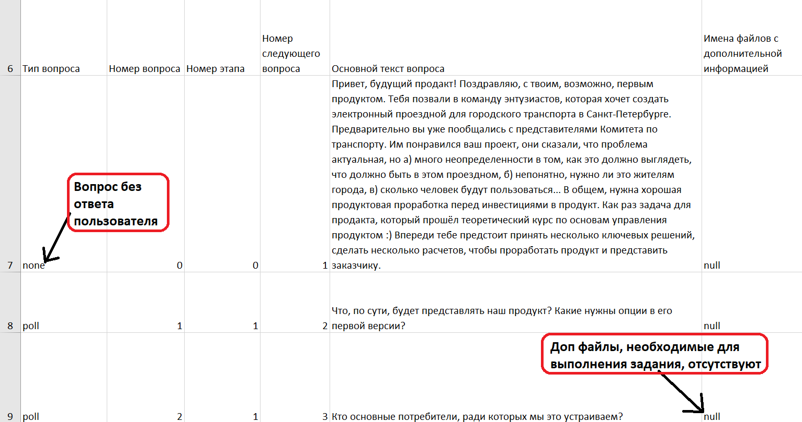
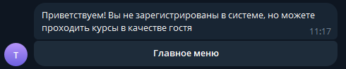

<!-- PROJECT LOGO -->
 

  

<h3 align="center">EduBot - интерактивная платформа с гибкими курсами и статистикой</h3>

  

    Разработчики проекта
     
    <a href="https://t.me/buran_2003">Developer_1</a>
    ·
    <a href="https://t.me/IlyaLight113">Developer_2</a>
  

<!-- TABLE OF CONTENTS -->

  
Оглавление

  <ol>
    <li>
      <a href="#О-ПРОЕКТЕ">О-проекте</a>
      <ul>
        <li><a href="#Использованный-стек">Использованный-стек</a></li>
      </ul>
    </li>
    <li>
      <a href="#Демонстрация-реализованного-функционала">Демонстрация-реализованного-функционала</a>
      <ul>
        <li><a href="#для-администратора/владельца-курса">для-администратора/владельца-курса</a></li>
        <li><a href="#для-обычного-пользователя-курса">для-обычного-пользователя-курса</a></li>
        <li><a href="#для-старосты-группы">для-старосты-группы</a></li>
        <li><a href="#для-пользователя,-не-записанного-на-курс(-ы)">для-пользователя,-не-записанного-на-курс(-ы)</a></li>
      </ul>
    </li>
    <li><a href="#Контакты">Контакты</a></li>
  </ol>

<!-- О ПРОЕКТЕ -->
## О-ПРОЕКТЕ

Идея проекта - создание платформы для обучения на базе Telegram-бота для студентов и преподавателей СПБПУ.

Мы постарались реализовать:
* платформу максимально удобной, чтобы каждый мог легко начать обучение.
* простой и интуитивный редактор курсов для создавания урококов с возможностью добавления текста, изображений, видео и тестов.
* подробнейшую статистику прохождения курсов :smile:

(<a href="#readme-top">back to top</a>)

### Использованный-стек

* [![.NET 6.0][dotnet-badge]][dotnet-url]
* [![Telegram.Bot][telegram-bot-badge]][telegram-bot-url]
* [![MySQL][mysql-badge]][mysql-url]
* [![OpenXML][openxml-badge]][openxml-url]
* [![TPL][tpl-badge]][tpl-url]
* [![Newtonsoft.Json][json-badge]][json-url]

(<a href="#readme-top">back to top</a>)

<!-- Демонстрация реализованного функционала -->
## Демонстрация-реализованного-функционала

### для-администратора/владельца-курса

Основное меню, через которое происходит взаимодействие с курсом(-ами) от лица владельца/администратора курса

 

  

(<a href="#readme-top">back to top</a>)

* (СПИСКИ) - Запрос списков групп, записанных на курс

 

  

 

  

(<a href="#readme-top">back to top</a>)

* Добавить кейс

Создание кейса происходит посредством заполнения Exel таблицы по шаблону, который можно запросить у бота.
В первых шести столбцах содержатся общие свойства вопросов кейса (тип, номер вопроса, номер этапа, текст вопроса,
имена файлов с доп информацией). С 7 по 12 столбец идут свойства условных переходов между вопросами, наличие 
множественного ответа на вопрос, добавления медиа-файлов в качестве ответа итд. Начиная с 13 столбца, идут варианты ответа на каждый вопрос.

 

  

(<a href="#readme-top">back to top</a>)

<h3 align="center"> Детализированный разбор заполнения шаблона создания курсов: </h3>

 

  

 

  

 

  

(<a href="#readme-top">back to top</a>)

* Статистика прохождения

Статистику прохождения можно запросить как на отдельно взятую группу, так и на весь поток групп, записанных на 
конкретный курс.

 

  

 

  

<h3 align="center"> При запросе статистики, выдается Exel следующего содержания: </h3>

 

  

 

  

<h3 align="center"> Баллы за каждое задание: </h3>

 

  

(<a href="#readme-top">back to top</a>)

* Ответы пользователей

В боте реализован функционал отправки ответов в виде медиа-файлов. Фукнция "ответы пользователей"
позволяет просматривать ответы, предоставленные учениками.

 

  

(<a href="#readme-top">back to top</a>)

### для-обычного-пользователя-курса

 

  

* Карточка пользователя

 

  

(<a href="#readme-top">back to top</a>)

### для-старосты-группы

 

  

* Добавить пользователей

 

  

 

  

 

  

(<a href="#readme-top">back to top</a>)

### для-пользователя,-не-записанного-на-курс(-ы)

Пользователи, которые не были добавлены старостами своих групп / владельцами курсов, могут проходить
их в формате гостя

 

  

 

  

* Карточка пользователя

 

  

* Перейти к курсам

 

  

(<a href="#readme-top">back to top</a>)

* Simulator (пример взаимодействия с ботом - ответы на задания)

 

  

 

  

(<a href="#readme-top">back to top</a>)

* Пример отправки медиа-файла

 

  

 

  

(<a href="#readme-top">back to top</a>)

<!-- CONTACT -->
## Контакты

Zhukov Gleb - [ТЫК](https://t.me/buran_2003) - Telegram; [ТЫК](https://t.me/buran_2003) - VK

Shemaev Kirill - [ТЫК](https://t.me/IlyaLight113) - Telegram; [ТЫК](https://vk.com/buran_2003) - VK

(<a href="#readme-top">back to top</a>)

<!-- MARKDOWN LINKS & IMAGES -->
[dotnet-badge]: https://img.shields.io/badge/.NET-6.0-512BD4?style=for-the-badge&logo=.net&logoColor=white
[dotnet-url]: https://dotnet.microsoft.com/download/dotnet/6.0
[mysql-badge]: https://img.shields.io/badge/MySQL-ADO.NET-4479A1?style=for-the-badge&logo=mysql&logoColor=white
[mysql-url]: https://dev.mysql.com/downloads/connector/net/
[openxml-badge]: https://img.shields.io/badge/OpenXML-C%23-2E5699?style=for-the-badge&logo=microsoft&logoColor=white
[openxml-url]: https://github.com/OfficeDev/Open-XML-SDK
[tpl-badge]: https://img.shields.io/badge/TPL-Async-C23F30?style=for-the-badge&logo=dot-net&logoColor=white
[tpl-url]: https://docs.microsoft.com/en-us/dotnet/standard/parallel-programming/task-parallel-library-tpl
[json-badge]: https://img.shields.io/badge/Newtonsoft.Json-C%23-47A7D1?style=for-the-badge&logo=json&logoColor=white
[json-url]: https://www.newtonsoft.com/json
[telegram-bot-badge]: https://img.shields.io/badge/Telegram.Bot-C%23-26A5E3?style=for-the-badge&logo=telegram&logoColor=white
[telegram-bot-url]: https://github.com/TelegramBots/Telegram.Bot
